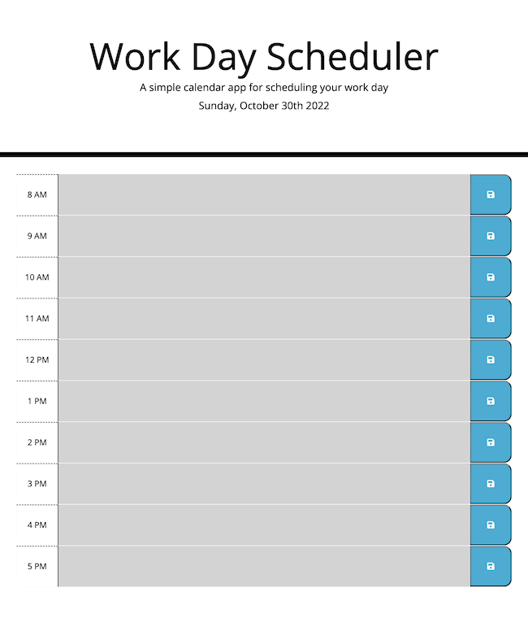
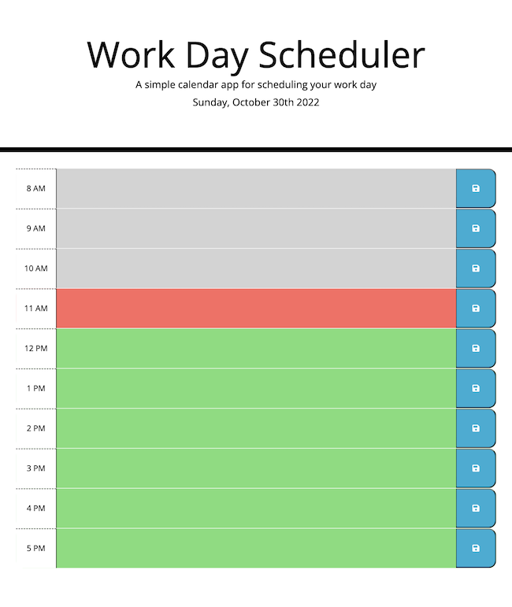
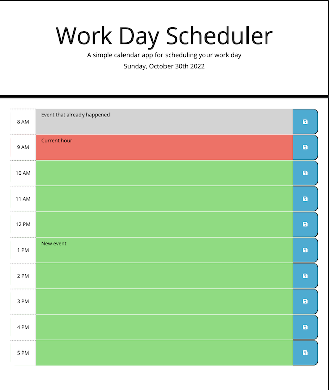

# Module 5 Challenge Third-Party APIs Challenge: Work Day Scheduler

## Description

A simple calendar app for scheduling the work day allowing the user to save events for each hour of the day. Each time block is color coded to indicate whether it is in the past, present, or future. This application runs in the browser and features dynamic HTML, CSS, JavaScript, and jQuery. Moment.js is used to work with the date and time. 

Link to deployed application: https://monicapong.github.io/workDayScheduler

## Usage

The current date is displayed at the top of the window, and a timeblock is displayed below allowing the user to enter and save events.

Each hour time block is color coded to represent the past, present, or future. The past is represented in light grey, the present is light red, and the future is represented in light green. 

Scroll to the respective hour, and enter the event as needed. Click on the save button to save the event. If the page is reloaded, the event persists. 

## License

Please refer to the GitHub Repository for licensing information. 
Link to GitHub repository: https://github.com/monicapong/workDayScheduler
